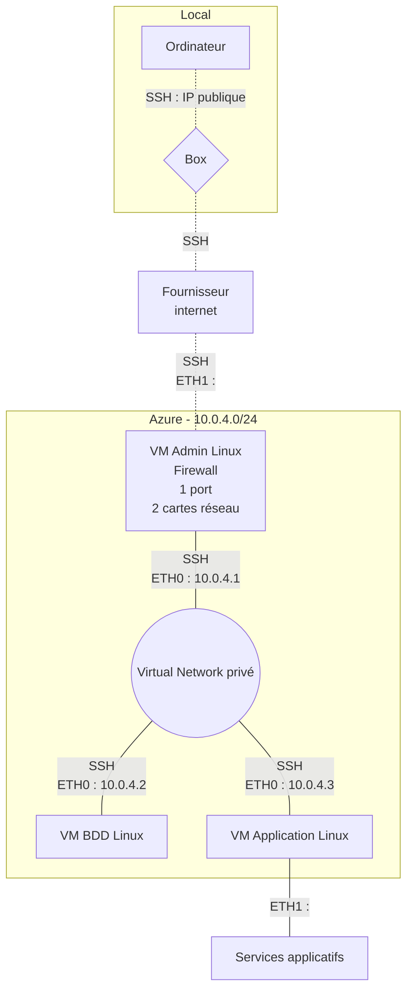

# Brief 2 : Déploiement manuel d’une application

## **Plan d'action du projet**

## 1. Plan réseau

## 2. Ressources

### Liste de ressources

- Réseau virtuel Vnet avec plage d'adresses en 10.0.4.0/24
- Interfaces réseau possédant une IP publique pour accéder via internet à la VM administrative (accessible via une clé rsa uniquement) et VM applicative (paramétrée uniquement pour la partie service)
- Trois autres interfaces réseau en IP privée pour permettre l'échange sur le réseau privé entre les trois VMs
- VM Administrative
- VM BDD
- VM Applicative
- 3 disques de stockage choisis en fonction des machines    

### VM Admin Linux
**Nom de la VM :** <mark>vm-linux-administration</mark>

**Groupe de ressources** : Brief_2_Groupe_4  
**Système d'exploitation** : Linux (Ubuntu 20.04 LTS)  
**Emplacement** : West US  
**Adresse IP privée** : 10.0.4.4  
**Adresse IP publique** : 20.125.147.172  
Matériel : 
Processeurs virtuels: 2

                       Intel(R) Xeon(R) Platinum 8370C CPU @ 2.80GHz

**RAM** 8 Giga  
**Système d'exploitation** : <mark>Ubuntu 20.04 LTS</mark>  
**vmId:** 25264c78-b9e1-4520-b7ee-7ca32cc8ddae  

**Adresse locale des cartes de la vm**:  
ETH0   inet 10.0.4.4   
Mask: 255.255.255.0  

**Connection sécurisé à la VM**
- [x] SSH
- [ ] RDP

|Nom du disque | Type de stockage | Taille (Gio) | IOPS max. | Débit max. (Mbits/s) | Chiffrement | Mise en cache de l'hôte|
|---|---|---|---|---|---|---|
|nomdudisqueadmin | HDD Standard LRS | 30 | 500 | 60 | SSE avec PMK | Lecture/Ecriture |

### VM Applicative Linux
**Nom de la VM :** <mark>vm-linux-administration</mark>

**Groupe de ressources** : Brief_2_Groupe_4  
**Système d'exploitation** : Linux (debian 11)  
**Emplacement** : West US  
**Adresse IP privée** : 10.0.4.2  
Matériel : 
Processeurs virtuels: 2

                       Intel(R) Xeon(R) Platinum 8272CL CPU @ 2.60GHz, 2593 MHz

**RAM** 4 Giga  
**Système d'exploitation** : <mark>Debian-11</mark>  
**vmId:** 25264c78-b9e1-4520-b7ee-7ca32cc8ddae  

**Adresse locale des cartes de la vm**:  
ETH0   inet 10.0.4.2   
Mask: 255.255.255.0  

**Connection sécurisé à la VM**
- [x] SSH
- [ ] RDP

|Nom du disque | Type de stockage | Taille (Gio) | IOPS max. | Débit max. (Mbits/s) | Chiffrement | Mise en cache de l'hôte|
|---|---|---|---|---|---|---|
|nomdudisqueserveurapp | HDD Standard LRS | 1 000| 500 | 60 | SSE avec PMK | Lecture/Ecriture |

### VM Base de donnée Linux
**Nom de la VM :** <mark>vm-linux-administration</mark>

**Groupe de ressources** : Brief_2_Groupe_4  
**Système d'exploitation** : Linux (Ubuntu 20.04 LTS)  
**Emplacement** : West US  
**Adresse IP privée** : 10.0.4.3  
**Adresse IP publique** : 20.119.46.96  
Matériel : 
Processeurs virtuels: 2

                       Intel(R) Xeon(R) Platinum 8272CL CPU @ 2.60GHz, 2593 MHz

**RAM** 4 Giga  
**Système d'exploitation** : <mark>Debian-11</mark>  
**vmId:** 25264c78-b9e1-4520-b7ee-7ca32cc8ddae  

**Adresse locale des cartes de la vm**:  
ETH0   inet 10.0.4.3   
Mask: 255.255.255.0  

**Connection sécurisé à la VM**
- [x] SSH
- [ ] RDP

|Nom du disque | Type de stockage | Taille (Gio) | IOPS max. | Débit max. (Mbits/s) | Chiffrement | Mise en cache de l'hôte|
|---|---|---|---|---|---|---|
|disquebasededonnees | SSD Premium | 8 | 3500 | 420 | SSE avec PMK | Lecture/Ecriture |

## 3. Tâches 

- Création du groupe de ressource : **Brief_2_Groupe_4**
- Création du réseau avec plage d'adressage des IP privées
- Déploiement des VM
- Configuration différente, basée selon les tâches de travail prévues par VM : 
  - Stockage plus rapide pour la VM Base De Données
  - Plus de CPU et de RAM pour la VM Applicative
  - Basique/Par défaut pour la VM Administrative
- Chargement des clefs publiques dans la VM Administrative
- Configuration des VMs :
  -  Administrative : Firewall
  -  Base De Données : MariaDB
  -  Applicative : Nextcloud
- Table de routage des interfaces réseaux
- Création de groupes d'utilisateurs
- Test des performances du système et du service aux utilisateurs
