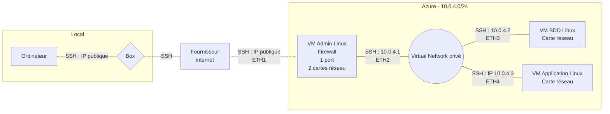

```mermaid
flowchart LR
    subgraph Local
    Ordinateur[Ordinateur] -.-|SSH : IP publique| Box{Box}
    end
    Box -.-|SSH| Internet[Fournisseur <br /> internet]
    Internet -.-|SSH : IP publique <br /> ETH1| VMAdmin[VM Admin Linux <br /> Firewall <br /> 1 port <br /> 2 cartes réseau]
    subgraph Azure - 10.0.4.0/24
    VMAdmin ---|SSH : 10.0.4.1 <br /> ETH2| VN((Virtual Network privé))
    VN ---|SSH : 10.0.4.2 <br /> ETH3| BDD[VM BDD Linux <br /> Carte réseau]
    VN ---|SSH : IP 10.0.4.3 <br /> ETH4| Appli[VM Application Linux <br /> Carte réseau]
    end
```
