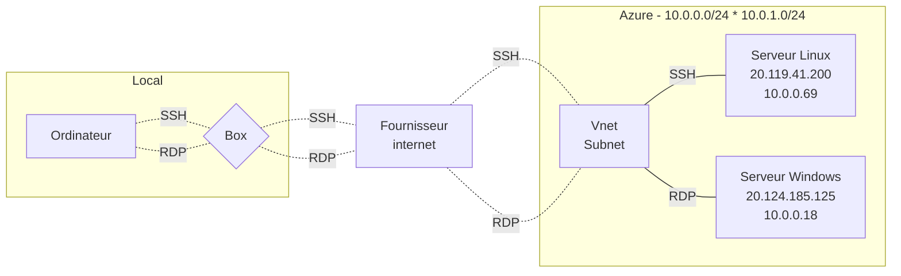

```mermaid
flowchart LR
    subgraph Local
    A[Ordinateur] -.-|SSH| B{Box}
    A[Ordinateur] -.-|RDP| B{Box}
    end
    B -.-|SSH| C[Fournisseur <br /> internet]
    B -.-|RDP| C[Fournisseur <br /> internet]
    C -.-|SSH| D[Vnet <br /> Subnet]
    C -.-|RDP| D[Vnet <br /> Subnet]
    subgraph Azure - 10.0.0.0/24 * 10.0.1.0/24
    D ---|SSH| E[Serveur Linux <br /> 20.119.41.200 <br /> 10.0.0.69]
    D ---|RDP| F[Serveur Windows <br /> 20.124.185.125 <br /> 10.0.0.18]
    end
```
