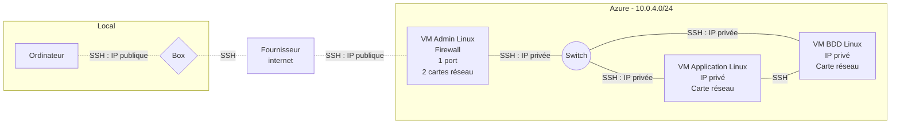

```mermaid
flowchart LR
    subgraph Local
    A[Ordinateur] -.-|SSH : IP publique| B{Box}
    end
    B -.-|SSH| C[Fournisseur <br /> internet]
    C -.-|SSH : IP publique| D[VM Admin Linux <br /> Firewall <br /> 1 port <br /> 2 cartes réseau]
    subgraph Azure - 10.0.4.0/24
    D ---|SSH : IP privée| E((Switch))
    E ---|SSH : IP privée| F[VM BDD Linux <br /> IP privé  <br /> Carte réseau]
    E ---|SSH : IP privée| G[VM Application Linux <br /> IP privé  <br /> Carte réseau]
    G---|SSH| F
    end
```
